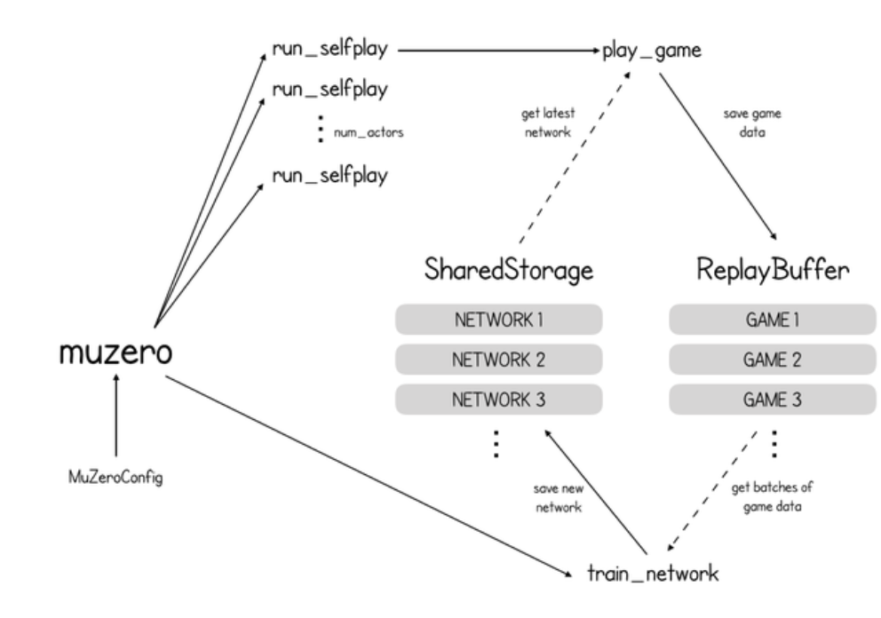

---
tags:
  - 強化学習
---

# MuZero

## 概略

- MuZeroConfig:「action_space_size」（可能な行動数）や「num_actors」（並列起動するゲームシミュレーションの数）など、実行のパラメータ化に関する重要な情報が格納
- セルフプレイ:(ゲームデータの作成）
- トレーニング:（ニューラルネットワークの改良版の作成）
- SharedStorage:ニューラルネットワークを保存します。最新のニューラルネットワークを取得するためのメソッド
- ReplayBuffer:オブジェクト:過去のゲームのデータを保存
- window_size:パラメータがバッファに保存されるゲームの最大数

- セルフプレイ（run_selfplay）:「SharedStorage」と「ReplayBuffer」を作成した後、「MuZero」は独立して実行される「num_actors」個のゲーム環境を並列起動する
-
