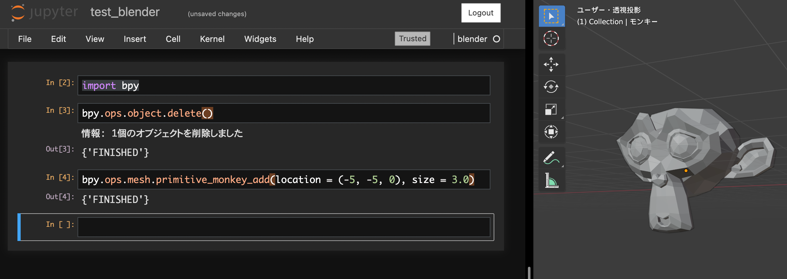

---
tags:
  - 02_設計ツール
---

# blender と freecad を jupyter notebook から使える環境の構築

blender,freecad 共に pythonAPI があります。各々ソフトの中にエディタがあり、そこでスクリプトを書いて実行できるのですが、ライブラリの追加や連携などが面倒くさいです。
そこで、anaconda から blender と freecad を使える環境を作りました。

## ソフトのインストール

1. anaconda のインストール
   仮想環境が使える場合は、最新で OK
1. blender のインストール
   最新で OK

## 仮想環境を作成

anaconda で仮想環境を作成します。python のバージョンは、blender の python のバージョンに合わせる必要があります。
私の環境では blender のバージョンは、2.91.2 で、python のバージョンは 3.7.7 なので、anaconda の python のバージョンを 3.7 にしました。

```
conda create --name freecad37 python=3.7 anaconda
```

## Freecad 関係

下記を実行すると、python3.7 の freecad を入れることができ、jupyter notebook に FreeCAD を import することができます

```
conda config --add channels conda-forge
conda install freecad python=3.7.6
```

## blender python API 関連

### jupyter から blender を使う

blender の python のバージョンと合わせる必要あり(今回は python3.7 で合わせている)

#### jupyter のカーネルに blender を追加する

下記のコマンドを実行する。blender の実行パスは、[blender_notebook](https://pypi.org/project/blender-notebook/)の説明を読んで変更する。

```
pip install blender-notebook
blender_notebook install --blender-exec="/Applications/Blender.app/Contents/MacOS/Blender"
```

実行すると、`Are you sure to create? [y/N]:`と聞かれるので、`y`と入力すると、`Saving files to /Users/username/Library/Jupyter/kernels/blender `と表示されて、カーネルが追加される

#### 立ち上げ

jupyter notebook を立ち上げると、カーネルに`blender`が追加されており、これを立ち上げると、blender が jupyter notebook から使えるようになる。(blender も同時に立ち上げるので、結果を見ながらスクリプトが書けます! 便利)

#### テスト

テストとして、おさるさんを配置してみます
ちゃんとできました

```
import bpy
bpy.ops.object.delete()
bpy.ops.mesh.primitive_monkey_add(location = (-5, -5, 0), size = 3.0)
```



### 補完できるようにする

blender の python API は一部バイナリで提供されるため、一部補完が効かない。全部補完できるように下記を実行する。
※バージョンは blender のバージョンに合わせる
※バージョンがなければ、自分でも作れる

```
pip install fake-bpy-module-2.91
```

## blender ファイルを Freecad ファイルに変換

```
# ##### BEGIN GPL LICENSE BLOCK #####
#
#  This program is free software; you can redistribute it and/or
#  modify it under the terms of the GNU General Public License
#  as published by the Free Software Foundation; either version 2
#  of the License, or (at your option) any later version.
#
#  This program is distributed in the hope that it will be useful,
#  but WITHOUT ANY WARRANTY; without even the implied warranty of
#  MERCHANTABILITY or FITNESS FOR A PARTICULAR PURPOSE.  See the
#  GNU General Public License for more details.
#
#  You should have received a copy of the GNU General Public License
#  along with this program; if not, write to the Free Software Foundation,
#  Inc., 51 Franklin Street, Fifth Floor, Boston, MA 02110-1301, USA.
#
# ##### END GPL LICENSE BLOCK #####

bl_info = {
    "name": "FreeCAD Exporter",
    "category": "Import-Export",
    "author": "Yorik van Havre",
    "version": (1, 0, 0),
    "blender": (2, 80, 0),
    "location": "File > Export > FreeCAD",
    "description": "Exports a FreeCAD FCStd file",
    "warning": "This addon needs FreeCAD installed on your system.",
}

# DESCRIPTION

# This script exports the selected objects or the whole model as
# a FreeCAD .FCStd file.
# The development of this addon happens on the FreeCAD forum
# at https://forum.freecadweb.org (no thread yet, please
# create one ;) !)

# WARNING

# This addon requires FreeCAD to be installed on your system.
# A word of warning, your version of FreeCAD must be compiled
# with the same version of python as Blender. The first two
# numbers of the python version must be the same. For example,
# if Blender is using Pyhon 3.7.2, your version of FreeCAD must
# use Python 3.7 too (the third number after 3.7
#
# Once you have a Python3 version of FreeCAD installed, the FreeCAD
# Python module must be known to Blender. There are several ways to obtain
# this:
#
# 1) Set the correct path to FreeCAD.so (or FreeCAD.pyd on windows) in
#    the Addons preferences in user settings, there is a setting for
#    that under the addon panel
#
# 2) Copy or symlink FreeCAD.so (or FreeCAD.pyd on windows) to one of the
#    directories from the list you get when doing this in a Python console:
#
#    import sys; print(sys.path)
#
#    On Debian/Ubuntu and most Linux systems, an easy way to do this is is
#    to symlink FreeCAD.so to your local (user) python modules folder:
#
#    ln -s /path/to/FreeCAD.so /home/YOURUSERNAME/.local/lib/python3.6/site-packages
#
#    (make sure to use the same python version your blender is using instead
#    of 3.6)
#
# 3) A more brutal way if the others fail is to uncomment the following line
#    and set the correct path to where your FreeCAD.so or FreeCAD.pyd resides:
#
#    import sys; sys.path.append("/path/to/FreeCAD.so")
#
# A simple way to test if everything is OK is to enter the following line
# in the Python console of Blender. If no error message appears,
# everything is fine:
#
#    import FreeCAD


import sys, bpy, xml.sax, zipfile, os, mathutils

import time

#from bpy_extras.node_shader_utils import PrincipledBSDFWrapper

SKIP_REGIONS_MAX = 100 # the max number of faces in a n object for region finding

def export_fcstd(filename,
                 skiphidden=True,
                 selected=False,
                 scale=1.0,
                 report=None):

    """Creates a FreeCAD .FCStd file"""

    # start time
    start = time.time()

    # make sure we have the .FCStd extension
    filename = bpy.path.ensure_ext(filename, ".FCStd")

    # import the FreeCAD module
    try:
        # append the FreeCAD path specified in addon preferences
        user_preferences = bpy.context.preferences
        addon_prefs = user_preferences.addons[__name__].preferences
        path = addon_prefs.filepath
        if path:
            if os.path.isfile(path):
                path = os.path.dirname(path)
            print("Configured FreeCAD path:",path)
            sys.path.append(path)
        else:
            print("FreeCAD path is not configured in preferences")
        import FreeCAD
    except:
        print("Unable to import the FreeCAD Python module. Make sure it is installed on your system")
        print("and compiled with Python3 (same version as Blender).")
        print("It must also be found by Python, you might need to set its path in this Addon preferences")
        print("(User preferences->Addons->expand this addon).")
        if report:
            report({'ERROR'},"Unable to import the FreeCAD Python module. Check Addon preferences.")
        return {'CANCELLED'}

    # gather a list of objects
    scene = bpy.context.scene
    objects = [obj for obj in scene.objects if obj.type == 'MESH']
    if selected:
        objects = [obj for obj in objects if obj.select_get()]

    # remove invisible objects if needed
    if skiphidden:
        objects = [obj for obj in objects if obj.visible_get()]

    # init color dict to store face colors
    colors = {}

    # create FreeCAD document
    docname = os.path.splitext(os.path.basename(bpy.data.filepath))[0]
    if not docname:
        docname = "Unnamed"
    doc = FreeCAD.newDocument(docname)

    # build shapes
    for obj in objects:

        name = obj.name

        # apply modifers
        #mesh = obj.data
        depsgraph = bpy.context.evaluated_depsgraph_get()
        objeval = obj.evaluated_get(depsgraph)
        mesh = bpy.data.meshes.new_from_object(objeval)

        # apply object scaling
        mat = mathutils.Matrix()
        s0,s1,s2 = obj.matrix_world.to_scale()
        mat[0][0] = abs(s0)
        mat[1][1] = abs(s1)
        mat[2][2] = abs(s2)
        mesh.transform(mat)

        # create regions of connected flat faces with same mat id
        regions = []
        faces = list(mesh.polygons)
        if len(faces) <= SKIP_REGIONS_MAX:
            while faces:
                if not regions:
                    regions.append([faces.pop()])
                for region in regions:
                    found = False
                    for regface in region:
                        regedges = regface.edge_keys
                        for face in faces:
                            for edge in face.edge_keys:
                                if (edge in regedges) or (edge[::-1] in regedges):
                                    # this face shares an edge with a face already in regions
                                    if face.normal == regface.normal:
                                        if face.material_index == regface.material_index:
                                            # these two faces are part of a same region
                                            region.append(face)
                                            faces.remove(face)
                                            found = True
                                            # modifying a list while looping in it is dangerous, so we better break now
                                            break
                    if found:
                        break
                else:
                    if faces:
                        # no face found to add to existing regions, starting a new region
                        regions.append([faces.pop()])
        else:
            # too many faces... Leave them alone
            regions = [[face] for face in faces]

        elapsed = time.time() - start

        #print("Building object",name,"with",len(regions),"regions,",elapsed,"sec")

        import Part, DraftGeomUtils

        # build FreeCAD faces from regions
        faces = []
        for region in regions:
            # build list of border edges
            edges = {}
            for face in region:
                for edge in face.edge_keys:
                    if (edge in edges):
                        edges[edge] = edges[edge] + 1
                    elif (edge[::-1] in edges):
                        edges[edge[::-1]] = edges[edge[::-1]] + 1
                    else:
                        edges[edge] = 1
            borders = []
            for key,val in edges.items():
                if val == 1:
                    borders.append(key)
            # build FreeCAD edges
            fedges = []
            for border in borders:
                p1 = FreeCAD.Vector(list(mesh.vertices[border[0]].co))
                p2 = FreeCAD.Vector(list(mesh.vertices[border[1]].co))
                if scale != 1:
                    p1.multiply(scale)
                    p2.multiply(scale)
                if p1 != p2:
                    fedges.append(Part.makeLine(p1,p2))
            # sort by wires
            wires = DraftGeomUtils.findWires(fedges)
            if wires:
                for wire in wires:
                    if not wire.isClosed():
                        print("Open wires in",name)
                        break
                else:
                    # TODO do this better
                    try:
                        faces.append(Part.Face(wires))
                    except:
                        print("FIXME: Unable to form face from wire in",name)
            else:
                print("Unable to build border wires for",name)

        # upgrade shape to highest possible level
        if faces:
            try:
                shape = Part.Shell(faces)
                if shape.isClosed():
                    try:
                        shape = Part.Solid(shape)
                    except Part.OCCError:
                        pass
            except Part.OCCError:
                shape = Part.makeCompound(faces)

        # edge-only object
        else:
            edges = []
            for edge in mesh.edges:
                p1 = FreeCAD.Vector(list(mesh.vertices[edge.vertices[0]].co))
                p2 = FreeCAD.Vector(list(mesh.vertices[edge.vertices[1]].co))
                if scale != 1:
                    p1.multiply(scale)
                    p2.multiply(scale)
                if p1 != p2:
                    edges.append(Part.makeLine(p1,p2))
            if edges:
                shape = Part.makeCompound(edges)

        # add the object to the FreeCAD document
        fobj = doc.addObject("Part::Feature",name)
        fobj.Shape = shape
        mod = obj.rotation_mode
        # need to switch otherwise quaternion is not properly set...
        obj.rotation_mode = "QUATERNION"
        rot = obj.rotation_quaternion
        obj.rotation_mode = mod
        # FreeCAD Quaternion is XYZW while Blender is WXYZ
        rot = FreeCAD.Rotation(rot[1],rot[2],rot[3],rot[0])
        loc = obj.location
        loc = FreeCAD.Vector(loc[0],loc[1],loc[2])
        if scale != 1:
            loc.multiply(scale)
        fobj.Placement = FreeCAD.Placement(loc,rot)

        # build color data
        if faces:
            coldata = []
            for region in regions:
                i = region[0].material_index
                if i < len(obj.data.materials):
                    if hasattr(obj.data.materials[i],"diffuse_color"):
                        coldata.append(tuple(list(obj.data.materials[i].diffuse_color)[:3]))
                        continue
                # no material
                coldata.append(tuple(list(obj.color)[:3]))
            colors[name] = coldata
            #print(name,len(coldata),"colors,",len(shape.Faces),"faces")
            # TODO the OfflineRenderingUtils module doesn't support face colors yet.. So for now each object will have only one color

        # clean up the blender mesh
        bpy.data.meshes.remove(mesh)

    # build OpenInventor camera data
    pc = "PerspectiveCamera {&#10;  viewportMapping ADJUST_CAMERA&#10;  position --pos--&#10;  orientation --rot--  1.0&#10;  nearDistance 0.0001&#10;  farDistance 1000000&#10;  aspectRatio 1&#10;  focalDistance 15.0&#10;  heightAngle 30.0&#10;&#10;}&#10;"
    oc = "OrthographicCamera {&#10;  viewportMapping ADJUST_CAMERA&#10;  position --pos--&#10;  orientation --rot--  1.0&#10;  nearDistance 0.0001&#10;  farDistance 1000000&#10;  aspectRatio 1&#10;  focalDistance 15.0&#10;  height 30.0&#10;&#10;}&#10;"
    camera = None
    # find the first available 3D window
    for window in bpy.context.window_manager.windows:
        for area in window.screen.areas:
            if area.type == "VIEW_3D":
                for space in area.spaces:
                    if space.type == "VIEW_3D":
                        if space.region_3d.view_perspective == "PERSP":
                            camera = pc
                        else:
                            camera = oc
                        pos = camera_position(space.region_3d.view_matrix)
                        pos = str(pos[0])+" "+str(pos[1])+" "+str(pos[2])
                        camera = camera.replace("--pos--",pos)
                        rot = space.region_3d.view_rotation
                        rot = FreeCAD.Rotation(rot[1],rot[2],rot[3],rot[0])
                        rot = rot.multVec(FreeCAD.Vector(0,0,1))
                        rot = str(rot[0])+" "+str(rot[1])+" "+str(rot[2])
                        camera = camera.replace("--rot--",rot)
    #print("camera:",camera)

    # all done! save the doc with its colors dict
    import OfflineRenderingUtils
    OfflineRenderingUtils.save(doc,filename,guidata=None,colors=colors,camera=camera)
    FreeCAD.closeDocument(doc.Name)

    elapsed = time.time() - start

    print("Export finished without errors in",int(elapsed),"sec")
    return {'FINISHED'}


def camera_position(matrix):

    """ From 4x4 matrix, calculate camera location """

    # https://stackoverflow.com/questions/9028398/change-viewport-angle-in-blender-using-python

    t = (matrix[0][3], matrix[1][3], matrix[2][3])
    r = (
      (matrix[0][0], matrix[0][1], matrix[0][2]),
      (matrix[1][0], matrix[1][1], matrix[1][2]),
      (matrix[2][0], matrix[2][1], matrix[2][2])
    )
    rp = (
      (-r[0][0], -r[1][0], -r[2][0]),
      (-r[0][1], -r[1][1], -r[2][1]),
      (-r[0][2], -r[1][2], -r[2][2])
    )
    output = (
      rp[0][0] * t[0] + rp[0][1] * t[1] + rp[0][2] * t[2],
      rp[1][0] * t[0] + rp[1][1] * t[1] + rp[1][2] * t[2],
      rp[2][0] * t[0] + rp[2][1] * t[1] + rp[2][2] * t[2],
    )
    return output


#==============================================================================
# Blender Operator class
#==============================================================================


class EXPORT_OT_FreeCAD(bpy.types.Operator):

    """Exports the scene to a FreeCAD .FCStd file"""

    bl_idname = 'export_fcstd.export_freecad'
    bl_label = 'Export FreeCAD FCStd file'
    bl_options = {'REGISTER', 'UNDO'}

    # ExportHelper mixin class uses this
    filename_ext = ".fcstd"

    # Properties assigned by the file selection window.

    directory : bpy.props.StringProperty(maxlen=1024, subtype='FILE_PATH', options={'HIDDEN'})
    files : bpy.props.CollectionProperty(type=bpy.types.OperatorFileListElement, options={'HIDDEN'})
    filepath : bpy.props.StringProperty(name="File path", maxlen=1024, default="", subtype='FILE_PATH')
    filter_folder : bpy.props.BoolProperty(default=True, options={'HIDDEN'})
    filter_glob : bpy.props.StringProperty(default="*.FCStd", options={'HIDDEN'})
    option_skiphidden : bpy.props.BoolProperty(name="Skip hidden objects", default=True,
        description="Only export objects that are visible in Blender"
    )
    option_selected : bpy.props.BoolProperty(name="Selected only", default=True,
        description="Only export selected objects"
    )
    option_scale : bpy.props.FloatProperty(name="Scaling value", default=1.0,
        description="A scaling value to apply to exported objects. Default value of 1 means one Blender unit = 1 millimeter in FreeCAD"
    )

    # invoke is called when the user picks our Export menu entry.

    def invoke(self, context, event):
        self.filepath = bpy.path.ensure_ext(os.path.splitext(bpy.data.filepath)[0], ".FCStd")
        context.window_manager.fileselect_add(self)
        return {'RUNNING_MODAL'}

    # execute is called when the user is done using the modal file-select window.

    def execute(self, context):

        dir = self.directory
        for file in self.files:
            filestr = str(file.name)
            return export_fcstd(filename=dir+filestr,
                                skiphidden=self.option_skiphidden,
                                selected=self.option_selected,
                                scale=self.option_scale,
                                report=self.report)
        return {'FINISHED'}


class EXPORT_OT_FreeCAD_Preferences(bpy.types.AddonPreferences):


    """A preferences settings dialog to set the path to the FreeCAD module"""

    bl_idname = __name__

    filepath : bpy.props.StringProperty(
            name="Path to FreeCAD.so (Mac/Linux) or FreeCAD.pyd (Windows)",
            subtype='FILE_PATH',
            )

    def draw(self, context):
        layout = self.layout
        layout.label(text="FreeCAD must be installed on your system, and its path set below. Make sure both FreeCAD and Blender use the same Python version (check their Python console)")
        layout.prop(self, "filepath")


#==============================================================================
# Register plugin with Blender
#==============================================================================

classes = (
    EXPORT_OT_FreeCAD,
    EXPORT_OT_FreeCAD_Preferences,
    )

# needed if you want to add into a dynamic menu

def menu_func_export(self, context):

    self.layout.operator(EXPORT_OT_FreeCAD.bl_idname, text="FreeCAD (.FCStd)")


def register():

    from bpy.utils import register_class
    for cls in classes:
        register_class(cls)
    bpy.types.TOPBAR_MT_file_export.append(menu_func_export)


def unregister():

    from bpy.utils import unregister_class
    for cls in reversed(classes):
        unregister_class(cls)
    bpy.types.TOPBAR_MT_file_export.remove(menu_func_export)


if __name__ == "__main__":
    register()

```

```

bl_info = {
    "name": "FreeCAD Importer",
    "category": "Import-Export",
    "author": "Yorik van Havre",
    "version": (5, 0, 0),
    "blender": (2, 80, 0),
    "location": "File > Import > FreeCAD",
    "description": "Imports a .FCStd file from FreeCAD",
    "warning": "This addon needs FreeCAD installed on your system. Only Part- and Mesh-based objects supported at the moment.",
}

# DESCRIPTION

# This script imports FreeCAD .FCStd files into Blender. This is a work in
# progress, so not all geometry elements of FreeCAD might be suported at
# this point. The development of this addon happens on the FreeCAD forum
# at https://forum.freecadweb.org (no thread yet, please
# create one ;) !)

# WARNING

# This addon requires FreeCAD to be installed on your system.
# A word of warning, your version of FreeCAD must be compiled
# with the same version of python as Blender. The first two
# numbers of the python version must be the same. For example,
# if Blender is using Pyhon 3.7.2, your version of FreeCAD must
# use Python 3.7 too (the third number after 3.7
#
# Once you have a Python3 version of FreeCAD installed, the FreeCAD
# Python module must be known to Blender. There are several ways to obtain
# this:
#
# 1) Set the correct path to FreeCAD.so (or FreeCAD.pyd on windows) in
#    the Addons preferences in user settings, there is a setting for
#    that under the addon panel
#
# 2) Copy or symlink FreeCAD.so (or FreeCAD.pyd on windows) to one of the
#    directories from the list you get when doing this in a Python console:
#
#    import sys; print(sys.path)
#
#    On Debian/Ubuntu and most Linux systems, an easy way to do this is is
#    to symlink FreeCAD.so to your local (user) python modules folder:
#
#    ln -s /path/to/FreeCAD.so /home/YOURUSERNAME/.local/lib/python3.6/site-packages
#
#    (make sure to use the same python version your blender is using instead
#    of 3.6)
#
# 3) A more brutal way if the others fail is to uncomment the following line
#    and set the correct path to where your FreeCAD.so or FreeCAD.pyd resides:
#
#    import sys; sys.path.append("/path/to/FreeCAD.so")
#
# A simple way to test if everything is OK is to enter the following line
# in the Python console of Blender. If no error message appears,
# everything is fine:
#
#    import FreeCAD

# TODO

# support clones + hires
# support texts, dimensions, etc (non-part/mesh objects)

# HISTORY

# v1.0.0 - 12 june 2018 - initial release - basically working
# v2.0.0 - 21 june 2018 - option to turn cycles mat on/off, per-face material support,
#                         use of polygons when possible, shared materials
# v3.0.0 - 06 february 2019 - ported to Blender 2.80
# v4.0.0 - 07 february 2019 - API changes + support of transparency
# v5.0.0 - 13 august 2019 - small fixes and better info messages if things go wrong


import sys, bpy, xml.sax, zipfile, os

from bpy_extras.node_shader_utils import PrincipledBSDFWrapper

TRIANGULATE = False # set to True to triangulate all faces (will loose multimaterial info)

class FreeCAD_xml_handler(xml.sax.ContentHandler):

    """A XML handler to process the FreeCAD GUI xml data"""

    # this creates a dictionary where each key is a FC object name,
    # and each value is a dictionary of property:value pairs

    def __init__(self):

        self.guidata = {}
        self.current = None
        self.properties = {}
        self.currentprop = None
        self.currentval = None

    # Call when an element starts

    def startElement(self, tag, attributes):

        if tag == "ViewProvider":
            self.current = attributes["name"]
        elif tag == "Property":
            name = attributes["name"]
            if name in ["Visibility","ShapeColor","Transparency","DiffuseColor"]:
                self.currentprop = name
        elif tag == "Bool":
            if attributes["value"] == "true":
                self.currentval = True
            else:
                self.currentval = False
        elif tag == "PropertyColor":
            c = int(attributes["value"])
            r = float((c>>24)&0xFF)/255.0
            g = float((c>>16)&0xFF)/255.0
            b = float((c>>8)&0xFF)/255.0
            self.currentval = (r,g,b)
        elif tag == "Integer":
            self.currentval = int(attributes["value"])
        elif tag == "Float":
            self.currentval = float(attributes["value"])
        elif tag == "ColorList":
            self.currentval = attributes["file"]

    # Call when an elements ends

    def endElement(self, tag):

        if tag == "ViewProvider":
            if self.current and self.properties:
                self.guidata[self.current] = self.properties
                self.current = None
                self.properties = {}
        elif tag == "Property":
            if self.currentprop and (self.currentval != None):
                self.properties[self.currentprop] = self.currentval
                self.currentprop = None
                self.currentval = None


def import_fcstd(filename,
                 update=True,
                 placement=True,
                 tessellation=1.0,
                 skiphidden=True,
                 scale=1.0,
                 sharemats=True,
                 report=None):

    """Reads a FreeCAD .FCStd file and creates Blender objects"""

    try:
        # append the FreeCAD path specified in addon preferences
        user_preferences = bpy.context.preferences
        addon_prefs = user_preferences.addons[__name__].preferences
        path = addon_prefs.filepath
        if path:
            if os.path.isfile(path):
                path = os.path.dirname(path)
            print("Configured FreeCAD path:",path)
            sys.path.append(path)
        else:
            print("FreeCAD path is not configured in preferences")
        import FreeCAD
    except:
        print("Unable to import the FreeCAD Python module. Make sure it is installed on your system")
        print("and compiled with Python3 (same version as Blender).")
        print("It must also be found by Python, you might need to set its path in this Addon preferences")
        print("(User preferences->Addons->expand this addon).")
        if report:
            report({'ERROR'},"Unable to import the FreeCAD Python module. Check Addon preferences.")
        return {'CANCELLED'}
    # check if we have a GUI document
    guidata = {}
    zdoc = zipfile.ZipFile(filename)
    if zdoc:
        if "GuiDocument.xml" in zdoc.namelist():
            gf = zdoc.open("GuiDocument.xml")
            guidata = gf.read()
            gf.close()
            Handler = FreeCAD_xml_handler()
            xml.sax.parseString(guidata, Handler)
            guidata = Handler.guidata
            for key,properties in guidata.items():
                # open each diffusecolor files and retrieve values
                # first 4 bytes are the array length, then each group of 4 bytes is abgr
                if "DiffuseColor" in properties:
                    #print ("opening:",guidata[key]["DiffuseColor"])
                    df = zdoc.open(guidata[key]["DiffuseColor"])
                    buf = df.read()
                    #print (buf," length ",len(buf))
                    df.close()
                    cols = []
                    for i in range(1,int(len(buf)/4)):
                        cols.append((buf[i*4+3],buf[i*4+2],buf[i*4+1],buf[i*4]))
                    guidata[key]["DiffuseColor"] = cols
        zdoc.close()
        #print ("guidata:",guidata)
    doc = FreeCAD.open(filename)
    docname = doc.Name
    if not doc:
        print("Unable to open the given FreeCAD file")
        if report:
            report({'ERROR'},"Unable to open the given FreeCAD file")
        return {'CANCELLED'}
    #print ("Transferring",len(doc.Objects),"objects to Blender")

    # import some FreeCAD modules needed below. After "import FreeCAD" these modules become available
    import Part

    def hascurves(shape):

        for e in shape.Edges:
            if not isinstance(e.Curve,(Part.Line,Part.LineSegment)):
                return True
        return False

    matdatabase = {} # to store reusable materials

    fcstd_collection = bpy.data.collections.new("FreeCAD import")
    bpy.context.scene.collection.children.link(fcstd_collection)

    for obj in doc.Objects:
        #print("Importing",obj.Label)
        if skiphidden:
            if obj.Name in guidata:
                if "Visibility" in guidata[obj.Name]:
                    if guidata[obj.Name]["Visibility"] == False:
                        #print(obj.Label,"is invisible. Skipping.")
                        continue

        verts = []
        edges = []
        faces = []
        matindex = [] # face to material relationship
        plac = None
        faceedges = [] # a placeholder to store edges that belong to a face
        name = "Unnamed"

        if obj.isDerivedFrom("Part::Feature"):
            # create mesh from shape
            shape = obj.Shape
            if placement:
                placement = obj.Placement
                shape = obj.Shape.copy()
                shape.Placement = placement.inverse().multiply(shape.Placement)
            if shape.Faces:
                if TRIANGULATE:
                    # triangulate and make faces
                    rawdata = shape.tessellate(tessellation)
                    for v in rawdata[0]:
                        verts.append([v.x,v.y,v.z])
                    for f in rawdata[1]:
                        faces.append(f)
                    for face in shape.Faces:
                        for e in face.Edges:
                            faceedges.append(e.hashCode())
                else:
                    # write FreeCAD faces as polygons when possible
                    for face in shape.Faces:
                        if (len(face.Wires) > 1) or (not isinstance(face.Surface,Part.Plane)) or hascurves(face):
                            # face has holes or is curved, so we need to triangulate it
                            rawdata = face.tessellate(tessellation)
                            for v in rawdata[0]:
                                vl = [v.x,v.y,v.z]
                                if not vl in verts:
                                    verts.append(vl)
                            for f in rawdata[1]:
                                nf = []
                                for vi in f:
                                    nv = rawdata[0][vi]
                                    nf.append(verts.index([nv.x,nv.y,nv.z]))
                                faces.append(nf)
                            matindex.append(len(rawdata[1]))
                        else:
                            f = []
                            ov = face.OuterWire.OrderedVertexes
                            for v in ov:
                                vl = [v.X,v.Y,v.Z]
                                if not vl in verts:
                                    verts.append(vl)
                                f.append(verts.index(vl))
                            # FreeCAD doesn't care about verts order. Make sure our loop goes clockwise
                            c = face.CenterOfMass
                            v1 = ov[0].Point.sub(c)
                            v2 = ov[1].Point.sub(c)
                            n = face.normalAt(0,0)
                            if (v1.cross(v2)).getAngle(n) > 1.57:
                                f.reverse() # inverting verts order if the direction is couterclockwise
                            faces.append(f)
                            matindex.append(1)
                        for e in face.Edges:
                            faceedges.append(e.hashCode())
            for edge in shape.Edges:
                # Treat remaining edges (that are not in faces)
                if not (edge.hashCode() in faceedges):
                    if hascurves(edge):
                        dv = edge.discretize(9) #TODO use tessellation value
                        for i in range(len(dv)-1):
                            dv1 = [dv[i].x,dv[i].y,dv[i].z]
                            dv2 = [dv[i+1].x,dv[i+1].y,dv[i+1].z]
                            if not dv1 in verts:
                                verts.append(dv1)
                            if not dv2 in verts:
                                verts.append(dv2)
                            edges.append([verts.index(dv1),verts.index(dv2)])
                    else:
                        e = []
                        for vert in edge.Vertexes:
                            # TODO discretize non-linear edges
                            v = [vert.X,vert.Y,vert.Z]
                            if not v in verts:
                                verts.append(v)
                            e.append(verts.index(v))
                        edges.append(e)

        elif obj.isDerivedFrom("Mesh::Feature"):
            # convert freecad mesh to blender mesh
            mesh = obj.Mesh
            if placement:
                placement = obj.Placement
                mesh = obj.Mesh.copy() # in meshes, this zeroes the placement
            t = mesh.Topology
            verts = [[v.x,v.y,v.z] for v in t[0]]
            faces = t[1]

        if verts and (faces or edges):
            # create or update object with mesh and material data
            bobj = None
            bmat = None
            if update:
                # locate existing object (mesh with same name)
                for o in bpy.data.objects:
                    if o.data.name == obj.Name:
                        bobj = o
                        print("Replacing existing object:",obj.Label)
            bmesh = bpy.data.meshes.new(name=obj.Name)
            bmesh.from_pydata(verts, edges, faces)
            bmesh.update()
            if bobj:
                # update only the mesh of existing object. Don't touch materials
                bobj.data = bmesh
            else:
                # create new object
                bobj = bpy.data.objects.new(obj.Label, bmesh)
                if placement:
                    #print ("placement:",placement)
                    bobj.location = placement.Base.multiply(scale)
                    m = bobj.rotation_mode
                    bobj.rotation_mode = 'QUATERNION'
                    if placement.Rotation.Angle:
                        # FreeCAD Quaternion is XYZW while Blender is WXYZ
                        q = (placement.Rotation.Q[3],)+placement.Rotation.Q[:3]
                        bobj.rotation_quaternion = (q)
                        bobj.rotation_mode = m
                    bobj.scale = (scale,scale,scale)
                if obj.Name in guidata:
                    if matindex and ("DiffuseColor" in guidata[obj.Name]) and (len(matindex) == len(guidata[obj.Name]["DiffuseColor"])):
                        # we have per-face materials. Create new mats and attribute faces to them
                        fi = 0
                        objmats = []
                        for i in range(len(matindex)):
                            # DiffuseColor stores int values, Blender use floats
                            rgba = tuple([float(x)/255.0 for x in guidata[obj.Name]["DiffuseColor"][i]])
                            # FreeCAD stores transparency, not alpha
                            alpha = 1.0
                            if rgba[3] > 0:
                                alpha = 1.0-rgba[3]
                            rgba = rgba[:3]+(alpha,)
                            bmat = None
                            if sharemats:
                                if rgba in matdatabase:
                                    bmat = matdatabase[rgba]
                                    if not rgba in objmats:
                                        objmats.append(rgba)
                                        bobj.data.materials.append(bmat)
                            if not bmat:
                                if rgba in objmats:
                                    bmat = bobj.data.materials[objmats.index(rgba)]
                            if not bmat:
                                bmat = bpy.data.materials.new(name=obj.Name+str(len(objmats)))
                                bmat.use_nodes = True
                                principled = PrincipledBSDFWrapper(bmat, is_readonly=False)
                                principled.base_color = rgba[:3]
                                if alpha < 1.0:
                                    bmat.diffuse_color = rgba
                                    principled.alpha = alpha
                                    bmat.blend_method = "BLEND"
                                objmats.append(rgba)
                                bobj.data.materials.append(bmat)
                                if sharemats:
                                    matdatabase[rgba] = bmat
                            for fj in range(matindex[i]):
                                bobj.data.polygons[fi+fj].material_index = objmats.index(rgba)
                            fi += matindex[i]
                    else:
                        # one material for the whole object
                        alpha = 1.0
                        rgb = (0.5,0.5,0.5)
                        if "Transparency" in guidata[obj.Name]:
                            if guidata[obj.Name]["Transparency"] > 0:
                                alpha = (100-guidata[obj.Name]["Transparency"])/100.0
                        if "ShapeColor" in guidata[obj.Name]:
                            rgb = guidata[obj.Name]["ShapeColor"]
                        rgba = rgb+(alpha,)
                        bmat = None
                        if sharemats:
                            if rgba in matdatabase:
                                bmat = matdatabase[rgba]
                            else:
                                #print("not found in db:",rgba,"in",matdatabase)
                                pass
                        if not bmat:
                            bmat = bpy.data.materials.new(name=obj.Name)
                            # no more internal engine!
                            # bmat.diffuse_color = rgb
                            # bmat.alpha = alpha
                            #if enablenodes:
                            bmat.use_nodes = True
                            principled = PrincipledBSDFWrapper(bmat, is_readonly=False)
                            principled.base_color = rgb
                            if alpha < 1.0:
                                bmat.diffuse_color = rgba
                            if sharemats:
                                matdatabase[rgba] = bmat
                        bobj.data.materials.append(bmat)

            fcstd_collection.objects.link(bobj)
            #bpy.context.scene.objects.active = obj
            #obj.select = True

    FreeCAD.closeDocument(docname)

    # why is this here? I don't remember. It doesn't seem to work anymore anyway...
    #for area in bpy.context.screen.areas:
    #    if area.type == 'VIEW_3D':
    #        for region in area.regions:
    #            if region.type == 'WINDOW':
    #                override = {'area': area, 'region': region, 'edit_object': bpy.context.edit_object}
    #                bpy.ops.view3d.view_all(override)

    print("Import finished without errors")
    return {'FINISHED'}


#==============================================================================
# Blender Operator class
#==============================================================================


class IMPORT_OT_FreeCAD(bpy.types.Operator):

    """Imports the contents of a FreeCAD .FCStd file"""

    bl_idname = 'import_fcstd.import_freecad'
    bl_label = 'Import FreeCAD FCStd file'
    bl_options = {'REGISTER', 'UNDO'}

    # ImportHelper mixin class uses this
    filename_ext = ".fcstd"

    # Properties assigned by the file selection window.

    directory : bpy.props.StringProperty(maxlen=1024, subtype='FILE_PATH', options={'HIDDEN', 'SKIP_SAVE'})
    files : bpy.props.CollectionProperty(type=bpy.types.OperatorFileListElement, options={'HIDDEN', 'SKIP_SAVE'})
    option_skiphidden : bpy.props.BoolProperty(name="Skip hidden objects", default=True,
        description="Only import objects that where visible in FreeCAD"
    )
    option_update : bpy.props.BoolProperty(name="Update existing objects", default=True,
        description="Keep objects with same names in current scene and their materials, only replace the geometry"
    )
    option_placement : bpy.props.BoolProperty(name="Use Placements", default=True,
        description="Set Blender pivot points to the FreeCAD placements"
    )
    option_tessellation : bpy.props.FloatProperty(name="Tessellation value", default=1.0,
        description="The tessellation value to apply when triangulating shapes"
    )
    option_scale : bpy.props.FloatProperty(name="Scaling value", default=0.001,
        description="A scaling value to apply to imported objects. Default value of 0.001 means one Blender unit = 1 meter"
    )
    option_sharemats : bpy.props.BoolProperty(name="Share similar materials", default=True,
        description="Objects with same color/transparency will use the same material"
    )

    # invoke is called when the user picks our Import menu entry.

    def invoke(self, context, event):
        context.window_manager.fileselect_add(self)
        return {'RUNNING_MODAL'}

    # execute is called when the user is done using the modal file-select window.

    def execute(self, context):

        dir = self.directory
        for file in self.files:
            filestr = str(file.name)
            if filestr.lower().endswith(".fcstd"):
                return import_fcstd(filename=dir+filestr,
                                    update=self.option_update,
                                    placement=self.option_placement,
                                    tessellation=self.option_tessellation,
                                    skiphidden=self.option_skiphidden,
                                    scale=self.option_scale,
                                    sharemats=self.option_sharemats,
                                    report=self.report)
        return {'FINISHED'}


class IMPORT_OT_FreeCAD_Preferences(bpy.types.AddonPreferences):


    """A preferences settings dialog to set the path to the FreeCAD module"""

    bl_idname = __name__

    filepath : bpy.props.StringProperty(
            name="Path to FreeCAD.so (Mac/Linux) or FreeCAD.pyd (Windows)",
            subtype='FILE_PATH',
            )

    def draw(self, context):
        layout = self.layout
        layout.label(text="FreeCAD must be installed on your system, and its path set below. Make sure both FreeCAD and Blender use the same Python version (check their Python console)")
        layout.prop(self, "filepath")


#==============================================================================
# Register plugin with Blender
#==============================================================================

classes = (
    IMPORT_OT_FreeCAD,
    IMPORT_OT_FreeCAD_Preferences,
    )

# needed if you want to add into a dynamic menu

def menu_func_import(self, context):

    self.layout.operator(IMPORT_OT_FreeCAD.bl_idname, text="FreeCAD (.FCStd)")


def register():

    from bpy.utils import register_class
    for cls in classes:
        register_class(cls)
    bpy.types.TOPBAR_MT_file_import.append(menu_func_import)


def unregister():

    from bpy.utils import unregister_class
    for cls in reversed(classes):
        unregister_class(cls)
    bpy.types.TOPBAR_MT_file_import.remove(menu_func_import)


if __name__ == "__main__":
    register()

```
