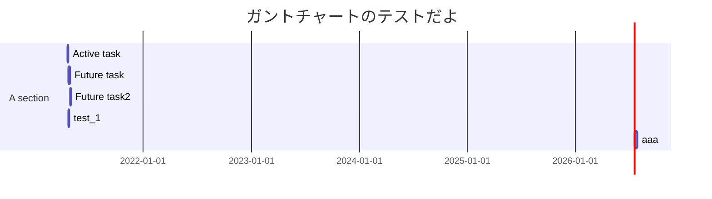
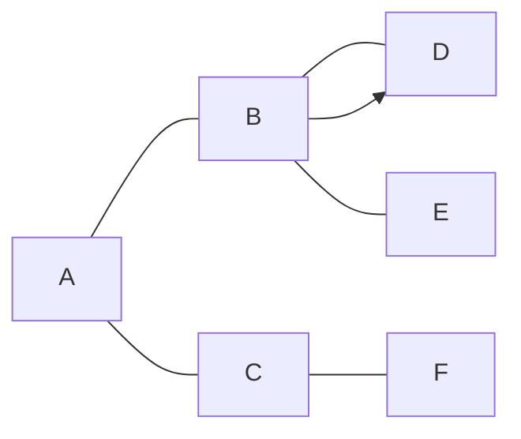

---
tags:
  - 01_チートシート
---

# h1 css テスト

## h2 参考のリンク

https://latele.co.jp/blog/tools/2017/0227_16

## 段組関係

あいう

```sss
sss
```

- dag
  ```
  agdf
  ```
  - sag
    ```
    agdf
    ```
- ag
  dsghs

1. daa
   1. dsag
   1. sag
      1. sagga
      1. dag
1. dahg
   dshsrjh
1. adh

- [ ] egdh
- [ ] dsrh
      dshsh
- [ ] shd
  - [ ] sagh
  - [ ] sag
    - [ ] sddv
      - [ ] sdsgda
        - [ ] dsGg

### h3

dagag

#### h4

agaa

##### h5

aga

## 強調

**だだああああああ**
asga
sagag

## イタリック

_ss_

## 引用

だ dh

---

> だ h
>
> > あえ h
> >
> > > あえは

## 色々あって、もう白でいいや!!!

### mermaid

しょうがないのです・・・[link](blender2cad.md)

#### いいいいい

##### あああ





## code block

```
import panda as pd
df = ...
```

## image

## checkbox

- [ ] asa
- [ ] sag
- [ ] sag

## 表

| 課  | 闘  | デイ | 投  | 高  | 同  | 願  |
| --- | --- | ---- | --- | --- | --- | --- |
|     | 135 | 170  |     | -80 |     |     |
|     | 135 | 170  |     | -80 |     |     |
|     | 135 | 170  | 50  | -80 |     |     |
|     | 135 | 170  |     | -80 |     |     |
|     | 135 | 170  | 50  | -80 |     |     |
|     | 135 | 170  |     | -80 |     |     |
