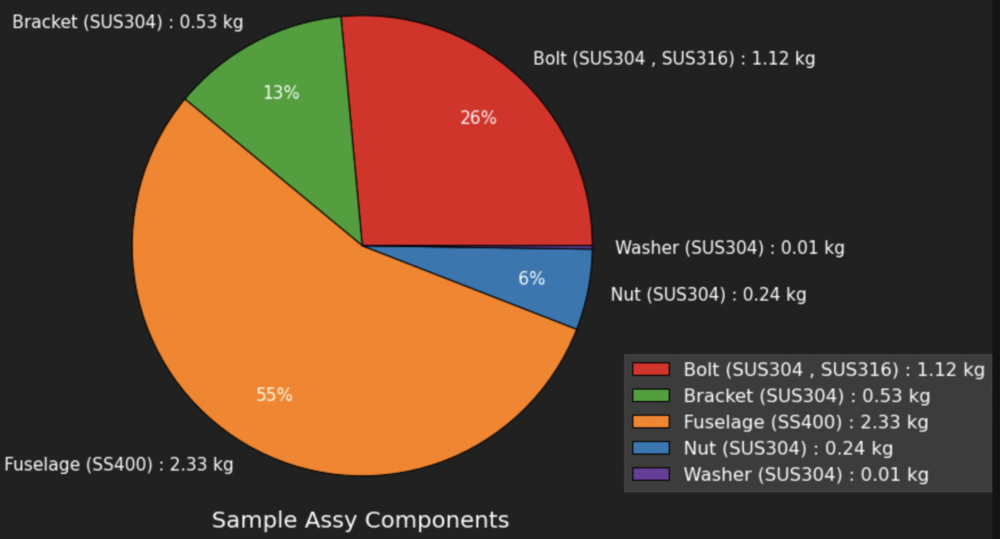

---
tags:
  - 01_チートシート
  - python
---

# pandas チートシートです

<!-- @import "[TOC]" {cmd="toc" depthFrom=2 depthTo=2 orderedList=false} -->

<!-- code_chunk_output -->

- [ライブラリのインストール](#ライブラリのインストール)
- [設定関係](#設定関係)
- [統計、データフレームのサマリ](#統計-データフレームのサマリ)
- [サンプルの作成](#サンプルの作成)
- [よく使うグラフ](#よく使うグラフ)
- [円グラフ](#円グラフ)
- [既存の列を処理して新しい列を作成する](#既存の列を処理して新しい列を作成する)
- [データのアップデート](#データのアップデート)
- [データフレーム同士の差分を見る table の diff](#データフレーム同士の差分を見る-table-の-diff)
- [前処理](#前処理)
- [置換](#置換)
- [重複の確認と処理](#重複の確認と処理)
- [行、列の並べ替え](#行-列の並べ替え)
- [行関係](#行関係)
- [列 columns 関係](#列-columns-関係)
- [型](#型)
- [データ抽出](#データ抽出)
- [集約](#集約)
- [セル](#セル)
- [書き込み](#書き込み)
- [pandas 読み込み](#pandas-読み込み)
- [文字列 すべてのセルの文字数を 8 個にする](#文字列-すべてのセルの文字数を-8-個にする)
- [時間 timestamp](#時間-timestamp)
- [sqlite](#sqlite)
- [イタレーション（おすすめしない）](#イタレーションおすすめしない)

<!-- /code_chunk_output -->

## ライブラリのインストール

- dataframe をマークダウン形式の表で出力する

```pip
pip install pytablewriter
```

```pytablewriter.py
import pytablewriter
writer = pytablewriter.MarkdownTableWriter()
writer.from_dataframe(df)
writer.write_table()
```

## 設定関係

### テーブルの表示設定

```sette.py
pd.options.display.max_columns = None
pd.options.display.max_rows = 100
```

### pandas table を綺麗に表示

```table.py
from plotly.offline import init_notebook_mode, iplot
import plotly.figure_factory as ff
iplot(ff.create_table(df))
```

## 統計、データフレームのサマリ

### サマリを表示

```summary.py
df_t.describe()
```

### 最頻を取得（多数決で決めたい場合に使った）

```saihin.py
df_temp.mode().iloc[[0]]
```

## サンプルの作成

### test データを作る

```test_data.py
import pandas as pd
df = pd.DataFrame([1,2,3,4,5],columns=["対象列"])

df = pd.DataFrame([[1,1],[2,2],[3,3],[4,4],[5,5]],columns=["対象列1","対象列2"])
# 上と同じ
df = pd.DataFrame({"対象列1":[1,2,3,4,5],
                   "対象列2":[1,2,3,4,5]
                  })
```

| 対象列 1 | 対象列 2 |
| -------: | -------: |
|        1 |        1 |
|        2 |        2 |
|        3 |        3 |
|        4 |        4 |
|        5 |        5 |

### 時系列のサンプル

```timeseries.py
import datetime
i=1000
now=datetime.datetime.now()
li=[now,i,i+10,i-10,i+5]
df = pd.DataFrame([li])

for p in range(3000):
    i=i+10
    if p != 2:
        li=[now+datetime.timedelta(seconds=p*45),i,i+10,i-10,i+5]
    else:
        li=[now+datetime.timedelta(seconds=p*45)," ","","",""]
#     df.replace(' ', '')
    df=df.append([li], ignore_index=True)
df.columns=["time", "open","high","low","close"]
df.to_csv("test.csv", index=False)
```

## よく使うグラフ

### 散布図

```graph_1.py
'''marker   https://matplotlib.org/api/markers_api.html
.:point ,o:circle, v:下三角, ^:上三角, s:四角 +:plus
linestyle   https://matplotlib.org/gallery/lines_bars_and_markers/linestyles.html?highlight=linestyle
solid,dotted,dashed,dashdot
color   https://matplotlib.org/examples/color/named_colors.html
b:青 (Blue) g:緑 (Green) r:赤 (Red) c:シアン (Cyan) m:マゼンタ (Magenta) y:黄 (Yellow) k:黒 (Black) w:白 (White)
'''
import matplotlib.pyplot as plt
import seaborn as sns
sns.set()# SeabornのデフォルトStyleを使用
fig = plt.figure(figsize=(8,4))# グラフのサイズを設定(横×縦)
ax = fig.add_subplot(111)
df.plot(x='x', y='z', ax=ax,
        linestyle='dashed', #線種
        marker='o', #マーカー
        color='darkgreen', #色
        linewidth = 0.5) #線の幅
df.plot(x='x', y='y', ax=ax,
        linestyle='dashed', #線種
        marker='o', #マーカー
        color='darkblue', #色
        linewidth = 0.5) #線の幅
ax.set_title("TEST")# TITLEを設定
ax.set_xlim(0,2*np.pi)# X軸の範囲
ax.set_ylim(-1,1)# Y軸の範囲
ax.set_xticks([0, np.pi, np.pi*2])# X軸のTick（目盛）の位置を設定
ax.set_xticklabels([0, 'π', '2π'])# X軸のTick（目盛）の表記を設定
ax.set_yticks([-1, -0.5, 0, 0.5, 1])# Y軸のTick（目盛）の位置を設定
ax.set_xlabel('X [RAD]')# X軸のラベルを設定
ax.set_ylabel('X [RAD]')# Y軸のラベルを設定
plt.show()# グラフ表示
```

### 動くグラフ

```g.py
%matplotlib inline
import pandas as pd
import cufflinks as cf
cf.set_config_file(offline=True, theme="white", offline_show_link=False)
cf.go_offline()

"""
pandas plot 動くグラフ　図　可視化 https://www.sejuku.net/blog/61788
https://qiita.com/inoory/items/7c8ca9fd5e1aca3e2e72
"""
df.iplot(xTitle="X軸名", yTitle="Y軸名", title="タイトル")
df.iplot(kind="scatter" ,mode='markers', x="col1", y=["col2"]) # 散布図
df.iplot(kind="scatter" ,mode='lines+markers', x="col1", y=["col2"]) # 散布図　線つき
df.iplot(kind="scatter" ,mode='lines', x="col1", y=["col2"]) # 散布図　線のみ
df.iplot(subplots=True, shape=(2,1), shared_xaxes=True)#subplot
"""
pandas plot 動くグラフ　図　可視化
 figの中身はdict型
"""
fig = df.figure(secondary_y="col2", yTitle="ylabel", xTitle="xlabel")
fig.layout.yaxis2.title = "y2label"
df.iplot(fig)

```

### 二軸のグラフ

\$を使うと、latex が使える

```twinx.py
import matplotlib.pyplot as plt
import numpy as np
import pandas as pd

%matplotlib inline

# MS Gothic,MS Mincho,,Yu Mincho, Malgun Gothic
plt.rcParams['font.family'] = 'MS Gothic' #全体のフォントを設定（日本語が使えるようにする）
plt.style.use('dark_background') # テーマを設定
plt.rcParams["font.size"] = 15 #フォントサイズの設定

df = pd.DataFrame({"time(s)":[0,100,200,300,1000],
                   "Heat transfer coefficient (W/m^2)":[30,90,45,50,20],
                   "temparature (K)":[500,600,650,450,600]
                  })

#下記を調整して、第二軸がいい感じになる所を見つける
min_y1 = 0 #第一軸の最小値
max_y1 = 100 #第一軸の最大値
sep = 11 #分割

x = df.columns[0]
y1 = df.columns[1]
y2 = df.columns[2]
y1_label = y1.replace(" ",r"\ ")
y2_label = y2.replace(" ",r"\ ")
x_label = x.replace(" ",r"\ ")

fig = plt.figure(figsize=(10,8))

ax1 = fig.add_subplot(111)
ln1=ax1.plot(df[x], df[y1],'C0',label='$'+y1_label+'$')

ax2 = ax1.twinx()
ln2=ax2.plot(df[x],df[y2],'C1',label='$'+y2_label+'$')

h1, l1 = ax1.get_legend_handles_labels()
h2, l2 = ax2.get_legend_handles_labels()
ax1.legend(h1+h2, l1+l2, loc='upper right')

ax1.set_title("入熱条件")
ax1.set_xlabel('$'+x_label+'$')
ax1.set_ylabel('$'+y1_label+'$')
ax1.grid(True)
ax2.set_ylabel('$'+y2_label+'$')

ax1.set_yticks(np.linspace(min_y1, max_y1, sep))
ax2.set_yticks(np.linspace(ax2.get_yticks()[0], ax2.get_yticks()[-1], len(ax1.get_yticks())))
```


## 円グラフ

```pie.py
import seaborn as sns
import matplotlib.pyplot as plt

def creat_pi(df_g):
    plt.rcParams.update({'font.size':16})
    fig = plt.figure(figsize=(8,8))

    x = df_g.round(2).tolist()
    legend = df_g.index.tolist()

    title = "Sample Assy Components"

    plt.pie(x=x,labels=legend,wedgeprops={'linewidth':1,'edgecolor':'black'},
            autopct=lambda p:'{:.0f}%'.format(p) if p>=2 else '',pctdistance=.75, textprops={'fontsize': 15})
    if legend != "":
        plt.legend(legend,fontsize=16,bbox_to_anchor=(1,0.3))
    if title != "":
        plt.title(title,fontsize=20,y=-0.1)
    plt.axis('equal')
    plt.show()
```



## 既存の列を処理して新しい列を作成する

### 既存列の文字列を split して別の列を作成する

```
df["month"] = df["date"].str.split("/").str[0:1].str.join("")
```

| date       | month |
| ---------- | ----- |
| 1975/12/28 | 1975  |
| 1975/12/28 | 1975  |
| -          | -     |
| -          | -     |


```
df = df["date"].str.split("/",expand=True)
df.rename(columns={0:"年",1:"月",2:"日"})
```


### 同一行内の計算

dataseries にして計算すれば、エクセルと同じイメージで計算できる  
 ずらしたい場合は、ずらした dataseries を作成して計算すればよい

```cal.py
df["計算"] = df["対象列1"] + df["対象列2"]
```

| 対象列 1 | 対象列 2 | 計算 |
| -------: | -------: | ---: |
|        1 |        1 |    2 |
|        2 |        2 |    4 |
|        3 |        3 |    6 |
|        4 |        4 |    8 |
|        5 |        5 |   10 |

### 集約関数

#### 累積和 cumsum

イメージ：excel で積分。材料力学の梁の計算で、荷重から SFD を求める際など

```cumsum.py
df["累積和"] = df["対象列"].cumsum()
```

| 対象列 | 累積和 |
| -----: | -----: |
|      1 |      1 |
|      2 |      3 |
|      3 |      6 |
|      4 |     10 |
|      5 |     15 |

#### 累積積 cumprod

```cumsum.py
df["累積積"] = df["対象列"].cumprod()
```

| 対象列 | 累積積 |     |
| ------ | ------ | --- |
| 0      | 1      | 1   |
| 1      | 2      | 2   |
| 2      | 3      | 6   |
| 3      | 4      | 24  |
| 4      | 5      | 120 |

#### 同一列の増加率(差)をとる

イメージ：excel で微分。材料力学の梁の計算で、SFD から荷重を求める際など  
 オプションで範囲を指定することができる

```diff.py
df["差分"] = df["対象列"].diff()
```

| 対象列 | 差分 |
| -----: | ---: |
|      1 |  NaN |
|      2 |    1 |
|      3 |    1 |
|      4 |    1 |
|      5 |    1 |

#### 最大値 max

```max.py
df["max"] = df.max(axis=1)
```

| 対象列 1 | 対象列 2 | max |
| -------: | -------: | --: |
|        1 |        1 |   1 |
|        2 |        2 |   2 |
|        3 |        6 |   6 |
|        4 |        8 |   8 |
|       10 |        5 |  10 |

### 1 行ずらした列を挿入

shift の引数で、ずらす数をコントロールできる。
`https://note.nkmk.me/python-pandas-shift/`

```shift.py
df["yesterday_close_value"] = df['close'].shift()#最後の行は自動で削除してくれるので、tableの数は一致
```

| close | yesterday_close_value |
| ----: | --------------------: |
|     1 |                   NaN |
|     2 |                     1 |
|     3 |                     2 |
|     4 |                     3 |
|     5 |                     4 |

### 関数を使用する

イメージ：excel で各セルを使って関数を適用。

#### 全要素に関数を適用 : applymap()

df の全要素に対して関数が適用される
下記例では、数字の奇数か偶数かを判定する。
x が各セルの値

```
import pandas as pd
import numpy as np
df = pd.DataFrame([[11,12,13,14],[21,22,23,24],[31,32,33,34]],columns=["a","b","c","d"])
f_oddeven = lambda x: 'odd' if x % 2 == 1 else 'even'
df.applymap(f_oddeven)
```

#### 各行に関数を適用して、列の ds を作成する apply(xxx,axis=1) ※ axis = 0 で列に関数適用し、行の ds を作成

```apply.py
df["関数"]= df.apply(lambda d: d['対象列1'] + d['対象列2'], axis=1)

#上と同じ
def func(df):
    d = df['対象列1'] + df['対象列2']
    return d
df["関数"] = df.apply(func, axis=1)
```

| 対象列 1 | 対象列 2 | 関数 |
| -------: | -------: | ---: |
|        1 |        1 |    2 |
|        2 |        2 |    4 |
|        3 |        3 |    6 |
|        4 |        4 |    8 |
|        5 |        5 |   10 |

#### 列名を変数にして apply を実行する

処理対象の列を変数にしたい場合
※応用として、変数を関数に渡したい場合に利用する

```
import pandas as pd
import numpy as np
df = pd.DataFrame([[11,12,13,14],[21,22,23,24],[31,32,33,34]],columns=["a","b","c","d"])

def func(row,x,y):
    out = row[x] + row[y]
    return out

x="a"
y="d"
df["out"] = df.apply(lambda row:func(row,x,y),axis=1)
```

#### 実例 1 階層の見える化

```level.py
import pandas as pd
df = pd.DataFrame([0,1,2,2,3,2,3,1],columns=["階層"])
def func(row,x):
    if row["階層"] == x:
        out =  "x"
    else:
        out=""
    return out

for i in range(df["階層"].max()+1):
    df[str(i)] = df.apply(lambda row:func(row,i),axis=1)
df
```

## データのアップデート

### 今あるデータをアップデート

データフレームの中身をアップデートします。
行列の数は合っていなくてもよいが、インデックスとカラムは存在していないといけない。

```sample.py
import pandas as pd
import numpy as np
df = pd.DataFrame([[1.5, np.nan, 3.],
                [1.5, np.nan, 3.],
                [1.5, np.nan, 3],
                [1.5, np.nan, 3]])

other = pd.DataFrame([[3.6, 2., np.nan],
                   [np.nan, np.nan, 7]], index=[1, 3])

df.update(other, overwrite=False) #nan以外は上書きしない
df.update(other)#nanであろうがなかろうが上書きする

expected = pd.DataFrame([[1.5, np.nan, 3],
                      [1.5, 2, 3],
                      [1.5, np.nan, 3],
                      [1.5, np.nan, 3.]])

pd.testing.assert_frame_equal(df, expected) #予想通りかどうかをテスト、expectedと異なるとエラーをはく
```

### 既存行を dataframe に置き換える(行を挿入して入れ替える)

```
df = df_moto.replace(np.nan,"-").copy()
df = df.set_index(df["部品番号"]+"___"+df["親"]+"___"+df["号機"].astype("str"))

df_hen = df_moto_hen.replace(np.nan,"-").copy()
df_hen = df_hen.set_index(df_hen["部品番号"]+"___"+df_hen["親"]+"___"+df_hen["号機"].astype("str"))

def insert_df_middle_row( idx, df_original, df_insert ):
  return df_original.loc[ :idx, ][:-1] \
            .append( df_insert ) \
            .append( df_original.loc[ idx:, ][1:] ) \

li =["22x34450-101___22x00001-101___1101"]

df_m = insert_df_middle_row(idx,df,df_hen)
```

【元のデータ】

| 部品番号     | 親           | 号機 | MB  |
| ------------ | ------------ | ---- | --- |
| 22x34456-101 |              | 1101 | M   |
| 22x34456-103 | 22x34456-101 | 1101 | M   |
| 22x34456-104 | 22x34456-101 | 1101 | B   |
| 22x34456-105 | 22x34456-101 | 1101 | B   |
| 22x34456-106 | 22x34456-101 | 1101 | M   |
| 22x34456-107 | 22x34456-101 | 1101 | M   |
| 22x34456-108 | 22x34456-101 | 1101 | M   |
| 22x34456-109 | 22x34456-101 | 1101 | B   |
| 22x00001-101 | 22x34456-101 | 1101 | B   |
| 22x34456-105 | 22x00001-101 | 1101 | M   |
| 22x34456-106 | 22x00001-101 | 1101 | B   |
| 22x34456-107 | 22x00001-101 | 1101 | M   |
| 22x34450-101 | 22x00001-101 | 1101 | M   |
| 22x34422-101 | 22x34456-101 | 1101 | M   |
| 22x34456-106 | 22x34422-101 | 1101 | B   |
| 22x34456-107 | 22x34422-101 | 1101 | M   |

【入れ込むデータ】

| 部品番号     | 親           | 号機 | MB  |
| ------------ | ------------ | ---- | --- |
| 22x34450-101 | 22x00001-101 | 1101 | M   |
| 22x00976-103 | 22x34450-101 | 1101 | M   |
| 22x00986-103 | 22x34450-101 | 1101 | M   |
| 22x00976-104 | 22x34450-101 | 1101 | B   |
| 22x00986-104 | 22x34450-101 | 1101 | B   |
| 22x00976-105 | 22x34450-101 | 1101 | B   |
| 22x00986-105 | 22x34450-101 | 1101 | M   |

## データフレーム同士の差分を見る table の diff

```
import pandas as pd
import numpy as np
df = pd.DataFrame([[11,12,13,14],[21,22,23,24],[31,32,33,34]],columns=["a","b","c","d"])
df_mod= pd.DataFrame([[11,12,444,14],[21,22,23,24],[31,32,45,34]],columns=["a","b","c","d"])
df.compare(df_mod)
df.compare(df_mod,align_axis=0)#行方向に表示
df.compare(df_mod, keep_shape=True)#もとの行列を保持
```

## 前処理

### 数値以外の文字列を含む場合の処理

参考：[pandas.DataFrame で数値以外の要素の抽出](https://qiita.com/kusmoto/items/058abc5b97ebfe77cf01)

```fillter_str.py
# 数値ではない型の要素の抽出
pic = df[['price']][df['price'].apply(lambda s:pd.to_numeric(s, errors='coerce')).isnull()]
# ',' の削除，'/' が含まれる要素を欠損値で置換
change_data = pic['price'].str.replace(',','').mask(pic['price'].str.contains('/'), np.nan)
# 元データのコピーを作成し，該当箇所を置換
df_c = df.copy()
df.loc[pic.index,'price'] = change_data
#'price' 列の数値を数値型に変換し，欠損値を含む行を削除
df_c['price'] = pd.to_numeric(df_c['price'], errors = 'ignore')
df_out  = df_c.dropna()
```

### 欠損値 nan の扱い

```dropna.py
df.dropna() #nanの行を削除（行内に一つでもnanがあれば　行を削除）
df.dropna(axis=1) #nanの列を削除（列内に一つでもnanがあれば　列を削除）
df.dropna(how='all') #すべての値が欠損値である行を削除する
df.dropna(how='all', axis=1) #すべての値が欠損値である列を削除する
df.dropna(how='all').dropna(how='all', axis=1) #行列両方に適用
df.dropna(subset=['age', 'state']) # 特定の列に欠損値がある行を削除する
df.dropna(subset=[0, 4], axis=1) #subsetで指定した行に欠損値がある列を削除
```

```fillna.py
df.fillna(0)#引数に置き換えたい値を指定するとすべての欠損値NaNがその値で置き換わる
df.fillna({'name': 'XXX', 'age': 20, 'point': 0})#引数に辞書を指定すると、列ごとに異なる値が代入
df.fillna(method='ffill') #前の値で置き換え
df.fillna(method='bfill') #後ろの値で置き換え
```

### inf 弾く

```inf.py
import numpy as np
df.replace([np.inf, -np.inf], np.nan)
```

```apply.py
df.apply(pd.Series.interpolate)#nanを前後の線形の値で埋めたい場合 https://openbook4.me/projects/183/sections/777
```

## 置換

### 辞書を使って置換 map

map()の引数に辞書型 dict を指定すると置換できる
※replace でもできるけど、map の方が高速

| id    | date       | month |
| ----- | ---------- | ----- |
| a     | 1975/12/28 | 1975  |
| a_b   | 1975/12/28 | 1975  |
| a_b_c | -          | -     |

`map_dict = dict(df["month"])`
`{'a': '1975', 'a_b': '1975', 'a_b_c': '-'}`

`df["test"]=df.index.map(map_dict)`
| id | date | month | test |
| ----- | ---------- | ----- | ---- |
| a | 1975/12/28 | 1975 | 1975 |
| a_b | 1975/12/28 | 1975 | 1975 |
| a_b_c | - | - | - |

### replace

- 完全一致の場合

`df["id"] = df["id"].replace("___","_")`

- 部分一致の場合(文字列)

`df["id"] = df["id"].str.replace("___","_")`

- 正規表現
  引数 regex=True で使える

```replace.py
df = df.replace([' ', '  :  ',"nan","  :  :  "], [np.nan, np.nan, np.nan, np.nan])#特定の文字列をnanに変更
df.replace('(.*)li(.*)', r'\1LI\2', regex=True) #正規表現を使用する
```

※()で囲んだ部分をグループとして、置換後の値の中で\1, \2 のように順番に使用可能

## 重複の確認と処理

```juhuku.py
df.duplicated().any() #重複チェック
df.duplicated(['x', 'y']).any() #部分的な重複チェック x と y 列の重複チェックは True
df.drop_duplicates(['x', 'y']) # 重複データを削除　前のデータを残す
df.drop_duplicates(['x', 'y'], keep='last') #重複データを削除　後のデータを残す
```

## 行、列の並べ替え

```python
df.reindex(index=['Two', 'Three', 'One'], columns=['B', 'C', 'A'])
```

## 行関係

### 並べ替え

```python
df.reindex(index=['Two', 'Three', 'One'])
```

### 上下反転(逆順)

```upsidedown.py
df.iloc[::-1]
```

### 行を削除

id を指定すればよい(下記は数字だけど、文字列で OK)

```
df.drop([3])
```

## 列 columns 関係

### 列 volume の名前を Volume に変更　 inplace=True で上書き

```rename.py
df.rename(columns = {'volume':'Volume'}, inplace=True)
```

### 列番号を列名から取得する

```get_loc.py
df.columns.get_loc('volume')
```

### 条件を付けて行の削除

```row_drop.py
df.drop(df.query('age < 25').index)
```

### 列の削除

```drop.py
df=df.drop(["high"], axis=1)#列の削除
```

### 列の並べ替え

```python
df.reindex(columns=['B', 'C', 'A'])
```

```get_loc.py
df=df.loc[:,["x","y","z"]]#列
の順番を変更["y","x","Z"]を["x","y","z"]に並び替える
```

### 列の順序を反転

```retsu.py
df[df.columns[::-1]]
```

### index の指定

```index.py
df=df.set_index("時間")
df.index=pd.DatetimeIndex(df.index)
```

### 列番号で選択

```retsu_bango.py
df.iloc[0:,1]
```

## 型

### 型を確認

```type.py
df.dtypes # 型確認
```

- 型の種類
  'b' boolean
  'i' (signed) integer
  'u' unsigned integer
  'f' floating-point
  'c' complex-floating point
  'O' (Python) objects
  'S', 'a' (byte-)string
  'U' Unicode
  'V' raw data (void)

### 型変更

数値に変更

```type_1.py
df=df.apply(pd.to_numeric, errors='ignore') #型変更（数字に変換）エラーは無視
df['現在値'].apply(pd.to_numeric, errors='coerce') #型変更（数字に変換）エラーはnanとなる
df['i'].astype(int)   #整数intに変換
df['i'].astype(float) #浮動小数点floatに変換
```

時間に変更

```type_2.py
df['date'] = pd.to_datetime(df['日時'], format='%Y/%m/%d %H:%M:%S', errors='coerce')#エラーはNaT
df['date'] = pd.to_datetime(df['日時'], format='%Y/%m/%d %H:%M:%S', errors='ignore')#エラーは無視
```

UNIX time から日時にする場合(フォーマットで文字列に変えて、repalce で nan を好きな文字に変更)

```
df['date'] = pd.to_datetime(df['date'], unit='s', errors='coerce').dt.strftime('%Y/%m/%d').replace(np.nan,"-")
```

文字列に変換

```
df['i'].astype(str) #数値を文字列に変換
```

## データ抽出

### 条件を指定して抽出

```data.py
df[df['age'] < 25] #比較演算子で条件指定
df[df.a > 0]  # aというカラムが0より大きいものを抽出
df[~df.a > 0] # aというカラムが0より大きいもの"以外"を抽出
df[df['state'].isin(['NY', 'TX'])]#in演算子で条件指定
df[(df['age'] < 25) & (df['point'] > 65)]#複数条件を指定
df_para.columns[df_para.columns.str.contains("MACD")]#部分一致

#query
df.query('age < 25')#条件を文字列で指定
df.query('not age < 25') #否定はnot
df.query('24 <= age < 50') #条件指定のように範囲を指定可能
df.query('age < point / 3')#列と列との比較や、算術演算子で計算して比較
df.query('state == "CA"') #一致、==
df.query('state != "CA"')#不一致は!=
df.query('state in ["NY", "TX"]')
df.query('name.str.endswith("e")', engine='python')# 特定の文字列で終わる
df.query('name.str.contains("li")', engine='python')#特定の文字列を含む
df.query('name.str.match(".*i.*e")', engine='python')#正規表現のパターンに一致する
df.query('index % 2 == 0')#index列に対する条件
val = 80 #変数を使う
df.query('point > @val')
df.query('age < 25 and point > 65')#&でもOK
df.query('age < 25 or point > 65')#|でもOK
df.query('age_year > 25', inplace=True)#引数inplaceで元のオブジェクトを更新
df.query('not age < 25 and not point > 65')#否定はnot
```

3 つ以上での条件も同様だが、and のほうが or より優先順位が高いなど順番によって結果が異なるので、先に処理したいまとまりを括弧で囲んだほうが無難。

```data_2.py
df.query('(age == 24 | point > 80) & state == "CA"')
```

pandas データフレームの中からリストにある列の選択

```data_3.py
li = ['現在値','出来高',.....]
df1=df[li]
```

### テーブル間の差分(diff)でデータを抽出

データを変更した際に、変更箇所のみを抽出したい時に使う  
【use case】:レッドマインのチケットを csv で纏めて変更した際に、サーバへ反映するチケット id を抽出する

```diff.py
import pandas as pd
df = pd.DataFrame([["リンゴ",1],["オレンジ",2],["いちご",3],["レモン",4],["マンゴー",5]],columns=["id","数量"])
df_edit = df.copy()
df_edit.loc[df_edit['id']=="レモン", '数量']=15
df_diff = pd.concat([df,df_edit])
df_diff = df_diff.drop_duplicates(keep=False)
# keep="last"でdf_edit側の値を残す
df_diff.drop_duplicates(subset="id",keep="last")
```

## 集約

groupby で集約する。文字列も結合することもできる

```
df_mat = df.groupby("name")["material"].apply(list) .apply(lambda x:sorted(x)) .apply(' , '.join)
df_g = df.groupby("name" ).sum()
```

## セル

### セルの選択

```select.py
df.loc[df['項目']=="レモン", '数量'] #項目列レモンの数量列を選択
df.iloc[0,0] #行列を数字で選択
df.iat[0,0] #行列を数字で選択 こちらの方が早い
df.iat[0, df.columns.get_loc('volume')] #行列を数字で選択
df.loc['Bob', 'age'] #行列を名前で選択
df.at['Bob', 'age'] #行列を名前で選択
```

## 書き込み

- csv

```csv_write.py
df.to_csv("test.csv", index=True)
df.to_csv("test.csv", index=False)
```

## pandas 読み込み

### xlwingsで開いたエクセルをdf化

https://qiita.com/k_maki/items/7e86b8314422cb4588f7#excel%E3%81%AE%E8%AA%AD%E3%81%BF%E8%BE%BC%E3%81%BFxlwings
```
df = sh.used_range.options(pd.DataFrame, index=False).value
```

### csv

```csv_read.py
df = pd.read_csv(os.path.join(folder_path,csv_list[0]), index_col=0)#一番左の列をindexにする
df = df.astype("float")
df.index=pd.DatetimeIndex(df.index)
```

より早く読み込みたい場合は、DASK を使用すればよいらしい

https://note.com/225_dow/n/n39641a2e501b

### 時系列データ

```time_read.py
df=pd.read_csv("test_time.csv", header=0, index_col='time', parse_dates=True,na_values=[" ", 0],dtype="float")#読み込み
df.index=pd.DatetimeIndex(df.index)#インデックスを時間に指定
 df=df.between_time('9:00', '11:30')#特定の時間のみを取り出す（日時は関係なし）
df_temp = df[df.index >= pd.Timestamp(2019,1,25)]#2019年1月25日以降のデータを出す
```

### codec error 読み込み時に codec のエラーが出る場合

```codec.py
import codec
with codecs.open("file.csv", "r", "Shift-JIS", "ignore") as file:
    df = pd.read_table(file, delimiter=",")
```

### 数値で読み込み（タイプを指定）

```numerical.py
df=pd.read_csv( "test.csv", header=0, dtype="int")
df=pd.read_csv( "test.csv", header=0, dtype="float")
```

### 文字列で読み込み（タイプを指定）

```str.py
df=pd.read_csv( "test_other.csv", header=0, dtype="str")#文字列
```

### web から読み込み

```web.py
url = 'http://www.jma.go.jp/jp/warn/329_table.html'
fetched_dataframes = pd.io.html.read_html(url)
```

## 文字列 すべてのセルの文字数を 8 個にする

```8moji.py
moji = lambda x: x + " "* (8-len(x))
a=moji(str(253)) #253 -> 253
print(a,len(a)) # 253      8
df= df.applymap(moji) #すべてのセルの文字数を8個にする
"""
pandas 文字列 各列の文字列を結合  https://qiita.com/piroyoung/items/dd209801ca60a0b00c11
"""
df=df.assign(text_output=lambda df: df.apply(lambda row: "".join(row), axis=1))
```

## 時間 timestamp

```timestamp.py
today = pd.Timestamp(date.today())
pd.Timestamp(2019,12,15,9,10,1) #2019年12月15日9時10分1秒
```

## sqlite

sqlite は同時書き込みは苦手。書き込みは 1 個のみがよい。

### 読み書き共通

```sqlite_common.py
import pandas as pd
import sqlite3

db_name = os.path.join(os.environ['userprofile'],"temp","test.db")
conn = sqlite3.connect(db_name)

#--------------
# 読み書き処理
#--------------

conn.close()
```

### 書き込み

test テーブルに対して、index 込で書き込みを実施する

```sqlite_write.py

df_temp.to_sql('test',conn,if_exists='append',index=True)

```

### 読み込み

test テーブルからデータを読み込み

最新 5000 個のデータを取得する
order by jikan desc limit 5000 　： 時間列を降順でソートして、5000 個を取得

```sqlite_read.py

df_read_test=pd.read_sql_query('SELECT * FROM {} order by jikan desc limit 5000'.format('test'), conn,index_col="jikan")
df_read_test.index=pd.DatetimeIndex(df_read_test.index)

```

開始行と取得数を指定してデータを取得する
limit 100,1000 　： 100 を開始行として、1000 個を取得　 100 から 1100 行までを取得する

```sqlite_read_2.py
number_of_data=str(self.start_number) +"," +str(self.inkuri)
sql_bun = 'select * from {} '+'limit '+str(number_of_data)
df=pd.read_sql_query(sql_bun.format('stock_data'), conn, index_col='時間')
df.index=pd.DatetimeIndex(df.index)
df = df.replace([' ', '  :  ',"nan","  :  :  "], [np.nan, np.nan, np.nan, np.nan])

```

## イタレーション（おすすめしない）

- 縦方向にループ

```iterrows.py
for i, v in df.iterrows(): #下記の場合は、X,Yの列名があり、行方向へのループ（列の場合は行名を入れる）
    print (i, v['X'], v['Y'])    # iは行または列名　v は Series
```

- 横方向にループ

```iteritems.py
for i, v in df.iteritems():
    print (i, v['a'], v['b'], v['c'])   # v は Series
```
