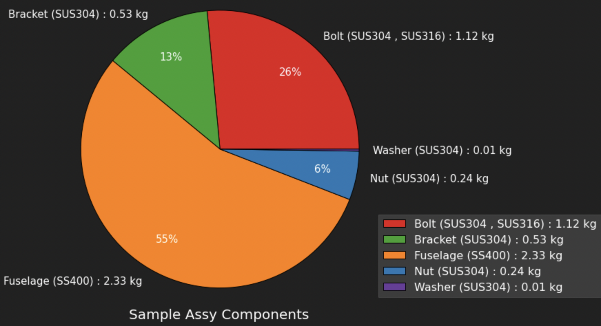

---
tags:
  - 02_設計ツール
---

# 部品表の整理

## サンプルデータ

```sample.py
import pandas as pd
df = pd.DataFrame({"name":["Fuselage","Bolt","Bracket","Nut","Bolt_2","Washer"],
                   "mass":[2.334,0.555,0.533,0.244,0.563,0.01],
                    "material":["SS400","SUS304","SUS304","SUS304","SUS316","SUS304"],
                    "quantity":[1,5,2,10,5,10]
                  })
```

| name     | mass  | material | quantity |
| -------- | ----- | -------- | -------- |
| Fuselage | 2.334 | SS400    | 1        |
| Bolt     | 0.555 | SUS304   | 5        |
| Bracket  | 0.533 | SUS304   | 2        |
| Nut      | 0.244 | SUS304   | 10       |
| Bolt_2   | 0.563 | SUS316   | 5        |
| Washer   | 0.01  | SUS304   | 10       |

## 集約

必要に応じて、集約し、円グラフのインプットデータを作る

```groupby.py
unit = "kg"
df = df.replace("_[0-9]*","",regex=True)
df_mat = df.groupby("name")["material"].apply(list) .apply(lambda x:sorted(x)) .apply(' , '.join)
df_g = df.groupby("name" ).sum()
df_g = pd.concat([df_g,df_mat],axis=1).reset_index()
df_g["index"] = df_g["name"] + " (" + df_g["material"].astype("str")  + ") : " + df_g["mass"].round(2).astype("str")  + " " + unit
df_g = df_g.set_index("index")
df_g = df_g["mass"]
```

| index                            | mass               |
| -------------------------------- | ------------------ |
| Bolt (SUS304 , SUS316) : 1.12 kg | 1.1179999999999999 |
| Bracket (SUS304) : 0.53 kg       | 0.533              |
| Fuselage (SS400) : 2.33 kg       | 2.334              |
| Nut (SUS304) : 0.24 kg           | 0.244              |
| Washer (SUS304) : 0.01 kg        | 0.01               |

## 円グラフの作成

```pie.py
import seaborn as sns
import matplotlib.pyplot as plt

def creat_pi(df_g):
    plt.rcParams.update({'font.size':16})
    fig = plt.figure(figsize=(8,8))

    x = df_g.round(2).tolist()
    legend = df_g.index.tolist()

    title = "Sample Assy Components"

    plt.pie(x=x,labels=legend,wedgeprops={'linewidth':1,'edgecolor':'black'},
            autopct=lambda p:'{:.0f}%'.format(p) if p>=2 else '',pctdistance=.75, textprops={'fontsize': 15})
    if legend != "":
        plt.legend(legend,fontsize=16,bbox_to_anchor=(1,0.3))
    if title != "":
        plt.title(title,fontsize=20,y=-0.1)
    plt.axis('equal')
    plt.show()

creat_pi(df_g)
```


